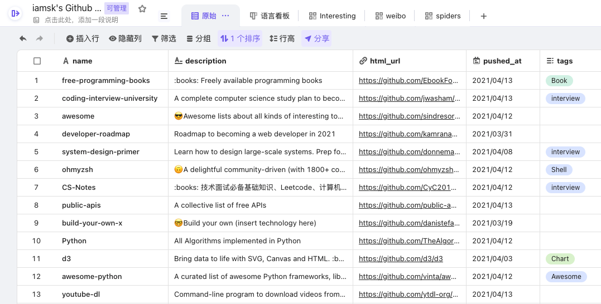
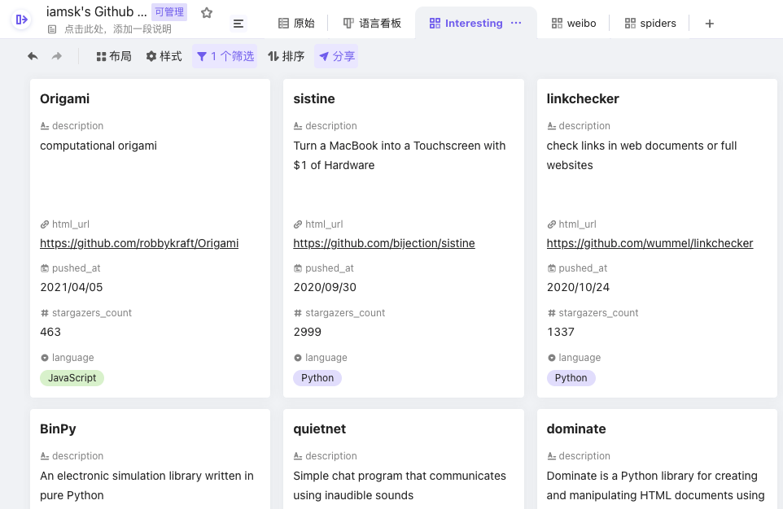

## Astral

Manage Github stars with ease based on multidimensional table!

A simple way to re-implement `https://app.astralapp.com/`





## Setup

- [Copy a table from Vika template](https://vika.cn/share/shrauFMzaw7EqxXkinmwg) so you can use your API keys.
- [Create a new GitHub OAuth App](https://developer.github.com/apps/building-oauth-apps/creating-an-oauth-app/) so you can plug in your API keys.
- Create a file `conf.py` and fill the config.

```python
VIKA_TOKEN = "xxx"
VIKA_TABLE = "xxx"
GITHUB_TOKEN = "xxx"
GITHUB_USERNAME = "iamsk"
```
- Install requirements
```shell script
pip install -r requirements.txt
```

## Sync new stars from Github

```shell script
python stars.py
```

# Todo

- [x] `stars.py` supporting transfer data from `https://app.astralapp.com/` to this
- [ ] Support [Airtable](https://airtable.com/) as back up of `Vika`
